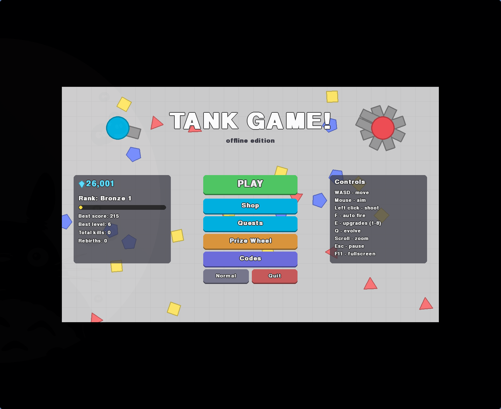

# Tank Game! (offline edition)



An offline clone of the Roblox game **💥 Tank Game!** (by the 7x3 group), which is
itself a Diep.io-style arena shooter. You shoot shapes for XP, level up to 150,
spend stat points, evolve through a tank tree, and fight 12 computer-controlled
tanks that stand in for the other players.

## Download and play

Download the build for your OS from the
[latest release](https://github.com/wmeints/tankgame/releases/latest). It bundles its own
Python, so you don't need to install anything.

- **Windows:** unzip `tankgame-<version>-windows-x86_64.zip` and run `tankgame.exe`.
  SmartScreen may warn about an unknown publisher. Click *More info*, then *Run anyway*.
- **macOS (Apple Silicon):** unzip `tankgame-<version>-macos-arm64.zip` and move
  `Tank Game.app` to Applications. The app isn't signed, so the first time, right-click it
  and choose *Open*, or run `xattr -dr com.apple.quarantine "/Applications/Tank Game.app"`.
- **Linux (x86_64):** extract `tankgame-<version>-linux-x86_64.tar.gz` and run `./tankgame`.

If you already have Python 3.14, you can install the wheel from the release instead:

```bash
pipx install tankgame-<version>-py3-none-any.whl
tankgame
```

## Developer setup (one time, needs internet)

```bash
mise install          # installs uv and lefthook, and sets up the git hooks (lefthook.yml)
uv sync               # creates .venv with Python 3.14 + pygame-ce
```

## Play from source (works offline)

```bash
uv run tankgame
```

| Key | Action |
|---|---|
| WASD / arrows | Move |
| Mouse | Aim |
| Left click (hold) | Shoot |
| F | Toggle auto fire |
| E | Show/hide upgrades panel. Keys 1-8 spend a point |
| Q | Evolution picker (flashes when you can evolve) |
| Scroll wheel | Zoom |
| R | Rebirth (at level 150) |
| Esc | Pause |
| F11 | Fullscreen |

## How it works (same as the original)

- **During a run:** shapes give XP: squares, triangles, pentagons, a big Alpha Pentagon in the center nest, and rare green *shiny* shapes that also give gems. Each level gives a stat point for one of 8 stats.
- **Evolving:** you evolve at levels 15, 30, 42, 60, 80, 90, 105, 130 and 150. The Freezer and Grinder branches also use levels 35, 37, 47 and 55.
- **Dying:** when you die the run starts over, but your gems are saved.
- **Gems:** you earn them by destroying tanks, from shiny shapes and quests, and a few at the end of each run. Spend them in the **Shop**:
  - **Stat Caps** raise the maximum points per stat, from 7 up to the original's maximum (Damage 12, Bullet Speed 13, ...).
  - **Tanks** unlock shop-only evolutions such as Ultra-Thunder, Machinima, Double Buckshot, Smashinator and Railgun (75,000 gems, like the original).
  - **Skins** change your tank color.
- **Ranks:** your total score across all runs raises your rank. Rank 10 unlocks **Blast Lord**.
- **Quests:** 3 daily quests, 2 weekly quests and a few one-time unique quests. Two of the unique quests unlock **Twinblast** and **Ultraship**.
- **Tank Index:** lists every tank with its evolution level, the tanks it evolves from and how to unlock it.
- **Codes:** the real game's codes work here too (HEADSTART, NEWCURRENCY, HAVEFUN, APOLLO, ...).
- **Rebirth:** at level 150 you can rebirth for gems and +5% XP forever.
- **Difficulty:** pick Easy, Normal or Hard in the main menu.
  - Easy and Normal bots won't hunt brand-new players unless they get shot first.
  - On Easy you take half damage.

The tree has 61 tanks across the Spammer, Scout, Double, Freezer/Flame, Grinder,
Slide and Orbitron branches. Tank names, levels and paths follow the original
game's build paths. Its exact damage and XP numbers aren't published, so those
use Diep.io's values, scaled up to 150 levels.

## Tweaking

All balance numbers are plain Python data:

- `src/tankgame/data/progression.py`: XP curve, stat formulas, shapes, gems, ranks, quests, codes, skins
- `src/tankgame/data/tanks.py`: every tank, its barrels, evolution level, parents and price
- `src/tankgame/ai.py`: difficulty settings for the bots

Progress is saved in `tankgame/save.json` in your OS's app data directory. Delete that file
to start over.

- Windows: `%APPDATA%\tankgame\save.json`
- macOS: `~/Library/Application Support/tankgame/save.json`
- Linux: `$XDG_DATA_HOME/tankgame/save.json` (default `~/.local/share/tankgame/save.json`)

On Windows and macOS, a save in the old `~/.local/share` location is picked up automatically.

## Development

```bash
uv run pytest                                   # unit tests
SDL_VIDEODRIVER=dummy uv run tankgame --simulate 3000   # headless smoke test
uv run --group build pyinstaller packaging/tankgame.spec   # standalone build in dist/
```

## Releasing

Bump `version` in `pyproject.toml`, merge it to `main`, then push a matching tag:

```bash
git tag v0.2.0 && git push origin v0.2.0
```

`.github/workflows/release.yml` runs the tests, builds and smoke-tests the Windows, macOS and
Linux executables plus the wheel, and publishes them as a GitHub Release. If the tag doesn't
match the project version, or any build or smoke test fails, nothing is published.
